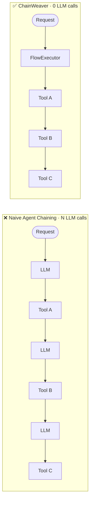

# ChainWeaver

**Compile deterministic MCP tool chains into LLM-free executable flows.**

[](https://pypi.org/project/chainweaver/)
[](https://github.com/dgenio/ChainWeaver/actions/workflows/ci.yml)
[](https://pypi.org/project/chainweaver/)
[](LICENSE)



```python
from chainweaver import Tool, Flow, FlowStep, FlowRegistry, FlowExecutor
# (NumberInput, ValueOutput, double_fn defined in full example below)

# 1. Wrap any function as a schema-validated Tool
double = Tool(name="double", description="Doubles a number.",
              input_schema=NumberInput, output_schema=ValueOutput, fn=double_fn)
# 2. Wire tools into a Flow
flow = Flow(name="calc", description="Double a number.",
            steps=[FlowStep(tool_name="double", input_mapping={"number": "number"})])
# 3. Register and execute — zero LLM calls
registry = FlowRegistry()
registry.register_flow(flow)
executor = FlowExecutor(registry=registry)
executor.register_tool(double)
result = executor.execute_flow("calc", {"number": 5})
# result.final_output → {"number": 5, "value": 10}
```

> See the [full example](#quick-start) below or run `python examples/simple_linear_flow.py`

**[Installation](#installation) · [Why ChainWeaver?](#why-chainweaver) · [Quick Start](#quick-start) · [Architecture](#architecture) · [Roadmap](#roadmap)**

---

## Why ChainWeaver?

When an LLM-powered agent chains tools together — `fetch_data → transform → store` — a
common pattern is to insert an LLM call between *every* step so the model can "decide"
what to do next.

```
User request
    │
    ▼
LLM call ──► Tool A
    │
    ▼
LLM call ──► Tool B
    │
    ▼
LLM call ──► Tool C
    │
    ▼
Response
```

For chains that are **fully deterministic** (the next step is always the same given the
previous output) these intermediate LLM calls add:

- **Latency** — each round-trip costs hundreds of milliseconds.
- **Cost** — every call consumes tokens and credits.
- **Unpredictability** — a language model might route differently on each invocation.

ChainWeaver compiles deterministic multi-tool chains into **executable flows** that run
without any LLM involvement between steps:

```
User request
    │
    ▼
FlowExecutor ──► Tool A ──► Tool B ──► Tool C
    │
    ▼
Response
```

Think of it as the difference between an **interpreter** and a **compiler**:

| Criterion | Naive LLM chaining | ChainWeaver |
|---|---|---|
| LLM calls per step | 1 per step | 0 |
| Latency | O(n × LLM RTT) | O(n × tool RTT) |
| Cost | O(n × token cost) | Fixed infra cost |
| Reproducibility | Non-deterministic | Deterministic |
| Schema validation | Ad-hoc / none | Pydantic enforced |
| Observability | Prompt logs only | Structured step logs |
| Reusability | Prompt templates | Registered, versioned flows |

---

## Installation

```bash
pip install chainweaver
```

Optional extras:

| Extra | Use when |
|-------|----------|
| `chainweaver[yaml]` | Reading / writing `.flow.yaml` files |
| `chainweaver[otel]` | Emitting OpenTelemetry spans for every flow run |
| `chainweaver[contrib]` | Importing the curated standard tool library (see [Standard tool library](#standard-tool-library)) |
| `chainweaver[langchain]` | Bidirectional adapters between ChainWeaver and LangChain `BaseTool` |
| `chainweaver[llamaindex]` | Bidirectional adapters between ChainWeaver and LlamaIndex `FunctionTool` |

---

## Quick Start

### Define tools, build a flow, and execute it

```python
from pydantic import BaseModel
from chainweaver import Tool, Flow, FlowStep, FlowRegistry, FlowExecutor

# --- 1. Declare schemas ---

class NumberInput(BaseModel):
    number: int

class ValueOutput(BaseModel):
    value: int

class ValueInput(BaseModel):
    value: int

class FormattedOutput(BaseModel):
    result: str

# --- 2. Implement tool functions ---

def double_fn(inp: NumberInput) -> dict:
    return {"value": inp.number * 2}

def add_ten_fn(inp: ValueInput) -> dict:
    return {"value": inp.value + 10}

def format_result_fn(inp: ValueInput) -> dict:
    return {"result": f"Final value: {inp.value}"}

# --- 3. Wrap as Tool objects ---

double_tool = Tool(
    name="double",
    description="Takes a number and returns its double.",
    input_schema=NumberInput,
    output_schema=ValueOutput,
    fn=double_fn,
)

add_ten_tool = Tool(
    name="add_ten",
    description="Takes a value and returns value + 10.",
    input_schema=ValueInput,
    output_schema=ValueOutput,
    fn=add_ten_fn,
)

format_tool = Tool(
    name="format_result",
    description="Formats a numeric value into a human-readable string.",
    input_schema=ValueInput,
    output_schema=FormattedOutput,
    fn=format_result_fn,
)

# --- 4. Define the flow ---

flow = Flow(
    name="double_add_format",
    description="Doubles a number, adds 10, and formats the result.",
    steps=[
        FlowStep(tool_name="double",        input_mapping={"number": "number"}),
        FlowStep(tool_name="add_ten",       input_mapping={"value": "value"}),
        FlowStep(tool_name="format_result", input_mapping={"value": "value"}),
    ],
)

# --- 5. Execute ---

registry = FlowRegistry()
registry.register_flow(flow)

executor = FlowExecutor(registry=registry)
executor.register_tool(double_tool)
executor.register_tool(add_ten_tool)
executor.register_tool(format_tool)

result = executor.execute_flow("double_add_format", {"number": 5})

print(result.success)       # True
print(result.final_output)  # {'number': 5, 'value': 20, 'result': 'Final value: 20'}

for record in result.execution_log:
    print(record.step_index, record.tool_name, record.outputs)
# 0 double {'value': 10}
# 1 add_ten {'value': 20}
# 2 format_result {'result': 'Final value: 20'}
```

You can also run the bundled examples directly:

```bash
python examples/simple_linear_flow.py   # simple arithmetic flow
python examples/etl_flow.py             # ETL flow: fetch → validate → normalize → enrich → store
python examples/mcp_search_flow.py      # MCP-style search → extract → format flow
python examples/naive_vs_compiled.py    # timing comparison: naive LLM calls vs ChainWeaver flow
```

### With the `@tool` decorator

The `@tool` decorator eliminates boilerplate by introspecting type hints to
auto-generate input schemas:

```python
from pydantic import BaseModel
from chainweaver import tool, Flow, FlowStep, FlowRegistry, FlowExecutor

class ValueOutput(BaseModel):
    value: int

class FormattedOutput(BaseModel):
    result: str

@tool(description="Doubles a number.")
def double(number: int) -> ValueOutput:
    return {"value": number * 2}

@tool(description="Adds ten.")
def add_ten(value: int) -> ValueOutput:
    return {"value": value + 10}

@tool(description="Formats the result.")
def format_result(value: int) -> FormattedOutput:
    return {"result": f"Final value: {value}"}

flow = Flow(
    name="double_add_format",
    description="Doubles a number, adds 10, and formats the result.",
    steps=[
        FlowStep(tool_name="double",        input_mapping={"number": "number"}),
        FlowStep(tool_name="add_ten",       input_mapping={"value": "value"}),
        FlowStep(tool_name="format_result", input_mapping={"value": "value"}),
    ],
)

registry = FlowRegistry()
registry.register_flow(flow)

executor = FlowExecutor(registry=registry)
executor.register_tool(double)
executor.register_tool(add_ten)
executor.register_tool(format_result)

result = executor.execute_flow("double_add_format", {"number": 5})
print(result.final_output)  # {'number': 5, 'value': 20, 'result': 'Final value: 20'}
```

Decorated tools are also directly callable:

```python
print(double(number=5))  # {'value': 10}
```

See `examples/decorator_tool.py` for a runnable before/after comparison.

### With `FlowBuilder`

`FlowBuilder` provides a fluent, chainable API as a more Pythonic alternative
to constructing `Flow` objects directly.  It produces an identical `Flow` — it
is syntax sugar, not a replacement:

```python
from chainweaver import FlowBuilder

flow = (
    FlowBuilder("double_add_format", "Doubles a number, adds 10, and formats.")
    .step("double", number="number")
    .step("add_ten", value="value")
    .step("format_result", value="value")
    .build()
)
```

- **`.step(tool_name, **mapping)`** — adds a step; string values are context-key
  lookups, non-string values are literal constants, no kwargs = full-context
  passthrough.
- **`.step_from(flow_step)`** — appends a pre-built `FlowStep` for interop.
- **`.with_input_schema(Model)`** / **`.with_output_schema(Model)`** — optional
  flow-level Pydantic schema declarations.
- **`.with_trigger(conditions)`** — optional free-form trigger metadata.
- **`.build()`** — returns a validated `Flow`; raises `FlowBuilderError` if
  `name` or `description` is missing.

---

## Architecture

```
chainweaver/
├── __init__.py       # Public API
├── builder.py        # FlowBuilder — fluent API for flow construction
├── compat.py         # schema_fingerprint, check_flow_compatibility
├── compiler.py       # compile_flow — static schema flow validation
├── decorators.py     # @tool decorator for zero-boilerplate tool definition
├── tools.py          # Tool — named callable with Pydantic schemas
├── flow.py           # FlowStep + Flow + FlowStatus — ordered step definitions
├── registry.py       # FlowRegistry — multi-version flow catalogue
├── executor.py       # FlowExecutor — deterministic, LLM-free runner
├── exceptions.py     # Typed exceptions with traceable context
└── log_utils.py      # Structured per-step logging
```

### Core abstractions

#### `Tool`

```python
Tool(
    name="my_tool",
    description="...",
    input_schema=MyInputModel,   # Pydantic BaseModel
    output_schema=MyOutputModel, # Pydantic BaseModel
    fn=my_callable,
)
```

A tool wraps a plain Python callable together with Pydantic models for strict
input/output validation.

#### `FlowStep`

```python
FlowStep(
    tool_name="my_tool",
    input_mapping={"key_for_tool": "key_from_context"},
)
```

Maps keys from the accumulated execution context into the tool's input schema.
String values are looked up in the context; non-string values are treated as
literal constants.

#### `Flow`

```python
Flow(
    name="my_flow",
    description="...",
    steps=[step_a, step_b, step_c],
    deterministic=True,          # metadata annotation; executor is always LLM-free
    trigger_conditions={"intent": "process data"},  # optional metadata
)
```

An ordered sequence of steps.

#### `FlowRegistry`

```python
registry = FlowRegistry()
registry.register_flow(flow)
registry.get_flow("my_flow")
registry.list_flows()
registry.match_flow_by_intent("process data")  # basic substring match
```

An in-memory catalogue of flows.

#### `FlowExecutor`

```python
executor = FlowExecutor(registry=registry)
executor.register_tool(tool_a)
result = executor.execute_flow("my_flow", {"key": "value"})
```

Runs a flow step-by-step with full schema validation and structured logging.
**No LLM calls are made at any point.**

#### `ChainAnalyzer`

```python
from chainweaver import ChainAnalyzer, ToolChain

analyzer = ChainAnalyzer(tools=[tool_a, tool_b, tool_c])

# All schema-compatible pairs
matrix: dict[str, list[str]] = analyzer.compatibility_matrix()

# All valid tool sequences up to length 3
chains: list[ToolChain] = analyzer.find_chains(max_depth=3)

# Filter by start or end tool
chains = analyzer.find_chains(max_depth=3, start="tool_a", end="tool_c")

# Promote chains to ready-to-register Flow objects
flows = analyzer.suggest_flows(max_depth=3, min_depth=2)
```

Discovers schema-compatible tool combinations **offline**, before any flow is
registered or executed. `compatibility_matrix()` checks that every required
input field of a consumer tool appears in the output of the producer with a
matching type. `suggest_flows()` auto-wires `input_mapping` by name-matching
and returns `Flow` objects ready for `FlowRegistry.register_flow()`.

### Data flow

```
initial_input (dict)
       │
       ▼
 ┌─────────────────────────────────────────────┐
 │  Execution context (cumulative dict)        │
 │                                             │
 │  Step 0: resolve inputs → run tool → merge  │
 │  Step 1: resolve inputs → run tool → merge  │
 │  Step N: resolve inputs → run tool → merge  │
 └─────────────────────────────────────────────┘
       │
       ▼
 ExecutionResult.final_output (merged context)
```

---

## MCP Integration Concept

ChainWeaver is designed to sit **between** an MCP server and your agent loop:

```
MCP Agent
   │  (observes tool call sequence at runtime)
   ▼
ChainWeaver FlowRegistry
   │  (matches pattern → retrieves compiled flow)
   ▼
FlowExecutor
   │  (runs deterministic steps without LLM involvement)
   ▼
MCP Tool Results
```

In practice:

1. An agent calls `tool_a`, then `tool_b`, then `tool_c` several times with
   the same routing logic.
2. A higher-level observer detects the pattern and registers a named `Flow`.
3. On subsequent invocations the executor runs the entire chain in a single
   call — no intermediate LLM calls required.

---

## Error Handling

All errors are typed and traceable:

| Exception | When it is raised |
|---|---|
| `ToolNotFoundError` | A step references an unregistered tool |
| `FlowNotFoundError` | The requested flow is not registered |
| `FlowAlreadyExistsError` | Registering a flow that already exists (without `overwrite=True`) |
| `FlowStatusError` | Executing a flow whose status is not `ACTIVE` (without `force=True`) |
| `InvalidFlowVersionError` | A flow is registered with a version string that is not valid PEP 440 |
| `FlowSerializationError` | A flow file (YAML/JSON) is malformed, has an unknown discriminator, or references an unresolvable class |
| `SchemaValidationError` | Input or output fails Pydantic validation |
| `InputMappingError` | A mapping key is not present in the context |
| `FlowExecutionError` | The tool callable raises an unexpected exception |
| `ToolDefinitionError` | The `@tool` decorator cannot build a tool from a function |
| `DAGDefinitionError` | A `DAGFlow` has a cycle, duplicate `step_id`, or unknown dependency |
| `ToolTimeoutError` | A `Tool` with `timeout_seconds` set exceeds the configured wall-clock cap |
| `ToolOutputSizeError` | A `Tool` with `max_output_size` set returns an output larger than the configured cap |
| `FlowBuilderError` | `FlowBuilder.build()` is called without a name or description |
| `AttestationInputError` | The attestation input generator cannot synthesize a value for a schema field |

All exceptions inherit from `ChainWeaverError`.

---

## Standard tool library

`chainweaver.contrib.tools` ships a curated set of deterministic
utility tools so that a new user can compose a meaningful flow on the
first afternoon without writing any `Tool` boilerplate.

```python
from chainweaver.contrib.tools import (
    assert_equal,
    filter_list,
    json_pluck,
    json_set,
    map_list,
    passthrough,
)
```

| Tool | Purpose |
|------|---------|
| `passthrough` | Identity — return the context unchanged. |
| `json_pluck` | Extract one value by RFC-6901 JSON pointer. |
| `json_set` | Set one value by RFC-6901 JSON pointer; returns a new dict. |
| `assert_equal` | Raise `ContribError` when two context keys differ. |
| `map_list` | Apply a registered sub-flow to each element of a list. |
| `filter_list` | Drop elements whose predicate sub-flow returns falsy. |

The library is **deterministic-only**: no HTTP, file I/O, database
access, RNG, or clocks.  Anything stateful belongs in user code.
Install with `pip install 'chainweaver[contrib]'`.

Runnable examples: [`examples/contrib_pluck_and_set.py`](examples/contrib_pluck_and_set.py),
[`examples/contrib_map_filter.py`](examples/contrib_map_filter.py).

---

## Export adapters

Hand a compiled flow off to any external agent framework via
`chainweaver.export`:

```python
from chainweaver.export import (
    flow_to_anthropic_tool,
    flow_to_callable,
    flow_to_openai_function,
)

openai_spec = flow_to_openai_function(flow, executor)
anthropic_spec = flow_to_anthropic_tool(flow, executor)
run = flow_to_callable(flow, executor)  # plain dict → dict callable
```

`flow_to_openai_function` emits the
`{"type": "function", "function": {…}}` shape OpenAI's chat / responses
APIs expect.  `flow_to_anthropic_tool` emits Anthropic's `tool_use`
shape.  `flow_to_callable` wraps the flow as a `Callable[[dict], dict]`
suitable for any framework that accepts arbitrary Python callables.

None of these adapters imports `openai` or `anthropic` — they emit
dicts and callables only.  Runtime integration with those clients is
the caller's job.

Runnable example: [`examples/export_openai_anthropic.py`](examples/export_openai_anthropic.py).

---

## Ecosystem bridges (LangChain, LlamaIndex)

`chainweaver.integrations.langchain` and
`chainweaver.integrations.llamaindex` ship thin bidirectional adapters
so existing LangChain `BaseTool` / LlamaIndex `FunctionTool`
instances can be pulled into ChainWeaver, and ChainWeaver `Tool`
instances can be pushed back out.

```python
from chainweaver.integrations.langchain import (
    from_langchain_tool,
    to_langchain_tool,
)

cw_tool = from_langchain_tool(my_langchain_tool)
lc_tool = to_langchain_tool(my_cw_tool)
```

Install with `pip install 'chainweaver[langchain]'` /
`'chainweaver[llamaindex]'`.  Importing either module without the
relevant extra raises a clear `ImportError`.

---

## Plugin discovery

For third-party packages — `chainweaver-aws`, `chainweaver-stripe`,
… — ChainWeaver follows the same entry-point convention used by
pytest, Sphinx, MkDocs, and friends.

Publisher (`pyproject.toml`):

```toml
[project.entry-points."chainweaver.tools"]
aws = "chainweaver_aws:get_tools"

[project.entry-points."chainweaver.flows"]
aws = "chainweaver_aws:get_flows"
```

Consumer:

```python
from chainweaver import FlowExecutor, FlowRegistry

# Auto-register every tool / flow advertised by an installed plugin.
registry = FlowRegistry(discover_plugins=True)
executor = FlowExecutor(registry=registry, discover_plugins=True)
```

Discovery is **opt-in** — importing `chainweaver` does not trigger
plugin imports.  Misbehaving plugins (raise on import, return the
wrong type) are logged at `WARNING` and skipped; pass
`strict=True` to `discover_tools()` / `discover_flows()` for the loud
form.

Runnable example: [`examples/plugin_discovery.py`](examples/plugin_discovery.py).

---

## Roadmap

Milestones below mirror the [GitHub milestones](https://github.com/dgenio/ChainWeaver/milestones); see
[CHANGELOG.md](CHANGELOG.md) for a per-release feature breakdown.

| Milestone | Theme | Status |
|-----------|-------|--------|
| **v0.1.0** — Harden Foundation & Streamline DX | Infra, docs, DX APIs, CI | shipped |
| **v0.2.0** — Build Core Execution & MCP Bridge | DAG execution, MCP adapter/server, guardrails | shipped |
| **v0.3.0** — Enable Composition, Resilience & Observation | Sub-flows, retry, serialization, governance pipeline | shipped |
| **v0.4.0** — Add Async, Persistence & Visualization | File-backed registry store, JSON/YAML flow serialization, ASCII/DOT visualization, multi-OS CI matrix | **shipped (current)** |
| **v0.5.0** — Enforce Schema Governance & Maturity | Fingerprinting, drift detection, structured traces | planned |
| **v0.6.0** — Expand Integrations & Ecosystem Reach | Replay, VirtualTool, export, LangChain/LlamaIndex bridges | planned |
| **v0.7.0** — Ship CLI & Validate Performance | CLI polish, benchmarks, offline LLM compiler | planned |
| **v1.0.0** — Finalize Stable Release | Ecosystem research, release criteria | planned (see [docs/v1-release-criteria.md](docs/v1-release-criteria.md)) |

---

## Command-line interface

ChainWeaver ships a `chainweaver` console script with eight subcommands:

```bash
# Run a flow from disk — no Python required.
chainweaver run flows/etl.flow.yaml \
    --tools my_pkg.tools \
    --input '{"date": "2026-05-15"}'

# Validate a flow file (used by CI gates and editor tooling).
chainweaver validate flows/etl.flow.yaml
chainweaver check flows/                  # whole-directory variant

# Render a registered flow as ASCII or Graphviz DOT.
chainweaver viz my_flow --format dot | dot -Tpng -o my_flow.png

# Inspect a registered flow's structure (table or JSON).
chainweaver inspect my_flow --format json

# Analyze execution traces for bottlenecks.
chainweaver profile trace1.json trace2.json

# Compare two execution results step-by-step.
chainweaver diff a.json b.json

# Observed-determinism attestation: run N inputs × M repeats.
chainweaver attest flows/etl.flow.yaml --tools my_pkg.tools --runs 50 --repeats 3
```

`run` is the fastest path from a fresh install to seeing a flow execute:
point it at a `.flow.yaml`/`.flow.json` file, pass `--tools <module>` (the
import path of a Python module that exposes `Tool` instances at top
level), and supply the initial input as JSON. Every subcommand also
supports `--format json` for machine consumption, and shares the same
exit-code contract (`0` success, `1` business-logic error, `2`
file-not-found / argument error).

---

## Development

```bash
# Install with dev dependencies
pip install -e ".[dev]"

# Run tests
python -m pytest tests/ -v

# Run the examples
python examples/simple_linear_flow.py   # simple arithmetic flow
python examples/etl_flow.py             # ETL flow
python examples/mcp_search_flow.py      # MCP-style search & summarize flow
python examples/naive_vs_compiled.py    # naive vs compiled timing comparison
```

---

## License

This project is licensed under the Apache License 2.0 - see the [LICENSE](LICENSE) file for details.
