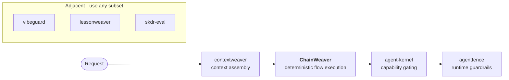

# ChainWeaver

**Observe the tool paths your agent repeats. Compile them into typed, deterministic flows. Replace the LLM-in-the-loop with governed, auditable execution.**

[](https://pypi.org/project/chainweaver/)
[](https://github.com/dgenio/ChainWeaver/actions/workflows/ci.yml)
[](https://pypi.org/project/chainweaver/)
[](LICENSE)
[](https://colab.research.google.com/github/dgenio/ChainWeaver/blob/main/notebooks/quickstart.ipynb)

<p align="center">
  
</p>

**The moat — observe → compile → replace.** Point ChainWeaver at the tool paths
your agent already repeats. `ChainAnalyzer` maps every schema-compatible chain
among your tools; you compile the ones worth keeping into typed `Flow` objects;
and `FlowExecutor` *replaces* the per-step LLM round-trips with deterministic,
schema-validated execution — no model in the loop. You compile the path the
analyzer surfaces instead of hand-wiring it.

**Governance for tool flows.** Typed I/O at every step, file-serializable
flows, schema-drift detection, determinism *attestation*, property fuzzing, and
structured audit traces — disciplined, auditable, portable deterministic
execution.

> **Quantified and reproducible.** In the repo's
> [benchmark report](benchmarks/results/latest.md), compiled flows show **0%
> data corruption** versus **61–96%** for naive LLM-in-the-loop chaining, and
> avoid **~$0.06** of LLM spend per 10-step flow. Regenerate it yourself with
> `python benchmarks/report.py`. Saving LLM calls is a *consequence* — not the
> headline.

```python
from chainweaver import Tool, Flow, FlowStep, FlowRegistry, FlowExecutor
# (NumberInput, ValueOutput, double_fn defined in full example below)

# 1. Wrap any function as a schema-validated Tool
double = Tool(name="double", description="Doubles a number.",
              input_schema=NumberInput, output_schema=ValueOutput, fn=double_fn)
# 2. Wire tools into a Flow
flow = Flow(name="calc", description="Double a number.",
            steps=[FlowStep(tool_name="double", input_mapping={"number": "number"})])
# 3. Register and execute — zero LLM calls
registry = FlowRegistry()
registry.register_flow(flow)
executor = FlowExecutor(registry=registry)
executor.register_tool(double)
result = executor.execute_flow("calc", {"number": 5})
# result.final_output → {"number": 5, "value": 10}
```

> See the [full example](#quick-start) below or run `python examples/simple_linear_flow.py`

**[Installation](#installation) · [Why ChainWeaver?](#why-chainweaver) · [Is this for me?](#is-this-for-me) · [Quick Start](#quick-start) · [Playground](#interactive-playground) · [Architecture](#architecture) · [Docs site](https://chainweaver.readthedocs.io/) · [Roadmap](#roadmap)**

---

## See it in 30 seconds

**The problem.** Your agent keeps doing the same path —
`search → extract → validate → format` — but on every single turn it
round-trips through the LLM between each tool call to "decide" what to
do next.  That's four model calls to execute one deterministic
operation.

**Before — naive agent loop, 4 model-mediated decisions:**

```
turn 1   ─►  LLM("plan")    ─►  search(query)         ─► 12 results
turn 2   ─►  LLM("next?")   ─►  extract(results)      ─► 8 facts
turn 3   ─►  LLM("next?")   ─►  validate(facts)       ─► 7 facts
turn 4   ─►  LLM("next?")   ─►  format(facts)         ─► answer
                                                          ⏱  ~6 s, 4 LLM calls
```

**After — same path, compiled once into a named ChainWeaver flow:**

```
turn 1   ─►  LLM("plan")    ─►  search_summarize_flow(query)
                                  └─ search ─► extract ─► validate ─► format
                                                          ⏱  ~1 s, 1 LLM call
```

The agent still decides *which* flow to invoke (that part stays
open-ended).  The four tool calls inside the flow no longer round-trip
through the model — `FlowExecutor` runs them with strict Pydantic
validation between every step and zero LLM involvement.

**Copy-paste quick path:**

```bash
pip install 'chainweaver[yaml]'
python examples/simple_linear_flow.py
```

The summary below is a condensed view of the real
`ExecutionResult` the script produces — the actual stdout also
includes per-step timestamps and the executor's structured step
log, but the values, the step order, and the final output are
exactly what you get on disk:

```
flow=double_add_format success=True
final_output={'number': 5, 'value': 20, 'result': 'Final value: 20'}
step 0 double          {'value': 10}
step 1 add_ten         {'value': 20}
step 2 format_result   {'result': 'Final value: 20'}
```

Three tool calls, no LLM in the loop, fully reproducible from
`examples/double_add_format.flow.yaml`.  Jump
to the [Quick Start](#quick-start) for the Python version, or to the
[Command-line interface](#command-line-interface) for the no-Python
path.

---

## Why ChainWeaver?

When an LLM-powered agent routes tools together — `fetch_data → transform → store` — a
common pattern is to insert an LLM call between *every* step so the model can "decide"
what to do next.

```
User request
    │
    ▼
LLM call ──► Tool A
    │
    ▼
LLM call ──► Tool B
    │
    ▼
LLM call ──► Tool C
    │
    ▼
Response
```

For flows that are **fully deterministic** (the next step is always the same given the
previous output) these intermediate LLM calls add:

- **Latency** — each round-trip costs hundreds of milliseconds.
- **Cost** — every call consumes tokens and credits.
- **Unpredictability** — a language model might route differently on each invocation.

ChainWeaver compiles deterministic multi-tool flows into **executable flows** that run
without any LLM involvement between steps:

```
User request
    │
    ▼
FlowExecutor ──► Tool A ──► Tool B ──► Tool C
    │
    ▼
Response
```

Think of it as the difference between an **interpreter** and a **compiler**:

| Criterion | Naive LLM loop | ChainWeaver |
|---|---|---|
| LLM calls per step | 1 per step | 0 |
| Latency | O(n × LLM RTT) | O(n × tool RTT) |
| Cost | O(n × token cost) | Fixed infra cost |
| Reproducibility | Non-deterministic | Deterministic |
| Schema validation | Ad-hoc / none | Pydantic enforced |
| Observability | Prompt logs only | Structured step logs |
| Reusability | Prompt templates | Registered, versioned flows |

### How is this different from LangChain / LangGraph / Prefect / Dagster / Temporal?

Short answer: those frameworks each make a different design choice that's
right for their own audience. ChainWeaver makes one specific trade-off —
**no LLM calls between steps, enforced at the framework level** — and
aligns the rest of the design (Pydantic-validated I/O, file-serializable
flows, no server) around it.

| | ChainWeaver | LangChain LCEL | LangGraph | Prefect 3 | Dagster | Temporal |
|---|---|---|---|---|---|---|
| LLM-free between steps | ✅ hard invariant | ⚠️ possible, not enforced | ⚠️ possible, not enforced | ✅ N/A | ✅ N/A | ✅ N/A |
| Pydantic-validated I/O | ✅ required | ⚠️ optional | ✅ | ✅ Pydantic 2 native | ⚠️ Dagster `Config` | ⚠️ optional |
| Lean dep set | ✅ 5 runtime pkgs | ❌ heavy | ❌ heavy | ❌ heavy | ❌ very heavy | ❌ heavy |
| File-serializable flows | ✅ YAML / JSON | ❌ | ❌ | ❌ | ❌ | ❌ |
| Standalone (no server) | ✅ | ✅ | ✅ | ⚠️ ephemeral mode | ⚠️ needs daemon | ❌ server required |

See [docs/comparisons.md](docs/comparisons.md) for the full matrix —
including version pins, citations to each alternative's own docs, and a
"when to pick which" guide.

---

## Is this for me?

ChainWeaver is built for one specific shape of problem. The
[full fit/non-fit page](https://chainweaver.readthedocs.io/en/latest/boundaries/) covers
the nuances; the short version:

**Use ChainWeaver when**

- The flow is predictable — you can name the next tool from the previous output
  without asking a model to decide.
- Determinism matters — same input must produce the same output, same execution path,
  same trace.
- You want strict schemas, audit-grade traces, and zero LLM calls between deterministic
  steps.

**Don't use ChainWeaver when**

- Every step requires open-ended reasoning to pick the next one (use an agent
  framework: LangGraph, the OpenAI / Anthropic SDK tool-use loops).
- You need a general workflow engine for scheduled / durable jobs across time
  (use Prefect, Dagster, or Temporal).
- You expect the executor to call an LLM. It deliberately doesn't.

### How ChainWeaver relates to neighbours

| | ChainWeaver | LangChain LCEL | Prefect 3 | Dagster | Temporal | LangGraph |
|---|---|---|---|---|---|---|
| LLM-free between steps (by design) | **Yes** | No | N/A | N/A | N/A | No |
| Pydantic-validated I/O at every step | **Yes** | Partial | No | Partial | No | No |
| Small runtime dependency set | **Yes** (5 packages) | No | No | No | No | No |
| File-serializable flow definitions | **Yes** (JSON / YAML) | No | Python | Python | Python | No |
| Standalone (no server / scheduler) | **Yes** | Yes | No | No | No | Yes |
| Stateful long-running workflows | No | No | Yes | Yes | Yes | Partial |
| Graph branches on LLM output | No (by design) | Limited | N/A | N/A | N/A | **Yes** |

The full one-paragraph-per-tool comparison lives at
[docs/comparisons.md](docs/comparisons.md) and on the
[hosted site](https://chainweaver.readthedocs.io/en/latest/comparisons/). Re-evaluated
on each minor release of any of the projects above.

For the correctness argument behind the design, see
[docs/data-integrity.md](docs/data-integrity.md).

### Part of the Weaver Stack

ChainWeaver is the **deterministic multi-step tool execution** layer of the
[Weaver Stack](https://github.com/dgenio/weaver-spec) — a family of small,
composable SDKs that share `weaver-spec`'s `SelectableItem` routing contract.
On the request path a router picks *which* capability to invoke, ChainWeaver
runs the deterministic tool path *behind* it, and downstream layers gate and
guard the call:



**Use standalone or together.** Each layer stands on its own — ChainWeaver's
base install has **no hard dependency** on any sibling and works fully
standalone. Real interop runs through the `chainweaver[weaver-stack]` extra,
which pins the published [`weaver-contracts`](https://pypi.org/project/weaver-contracts/)
package: ChainWeaver consumes its `SelectableItem` / `RoutingDecision` /
`CapabilityToken` types directly, so a router can hand a routing decision
straight to `resolve_flow_from_routing_decision()` for deterministic
execution. See the runnable
[Weaver Stack golden path](examples/weaver_stack_golden_path/) (issue #234).

| Layer | What it owns | Sibling project |
|-------|--------------|-----------------|
| Routing / capability selection | "Which named operation handles this request?" | `weaver-spec` (#91 — `SelectableItem` contract) |
| Context assembly | "What facts and tool descriptions belong in the prompt?" | `contextweaver` (#106) |
| Agent kernel | The model-mediated tool-use loop itself | `agent-kernel` (#89) |
| **Deterministic flow execution** | "Run this exact tool sequence with strict schemas, no LLM between steps" | **ChainWeaver — this repo** |
| Lessons & evaluation | Turning traces into reviewed operational guidance ([how ChainWeaver feeds it](docs/lessons-from-traces.md)) | `lessonweaver` (#210) |

ChainWeaver does **not** replace an agent framework.  It is meant to be
called *from* one — see the [LangGraph
recipe](docs/cookbook/langgraph-node.md) (issue #205) and the [OpenAI Agents
SDK recipe](docs/cookbook/openai-agents-tool.md) (issue #206) for
the canonical integration patterns.

For host-level expectations (when to invoke, how to store traces,
side-effect tools, MCP parity), see the
[Runtime responsibilities](docs/runtime-responsibilities.md) page.

---

## Installation

```bash
pip install chainweaver                  # base install — no extras
pip install 'chainweaver[yaml]'          # most common — needed for .flow.yaml files
pip install 'chainweaver[yaml,otel,mcp]' # combine extras with commas
```

The base install pulls only five runtime dependencies (`deepdiff`,
`packaging`, `pydantic`, `tenacity`, `typer`) and has no transitive LLM
SDK pinned.  Pick extras for the integrations you actually use:

| Extra | Use when | Pulls in |
|-------|----------|----------|
| `chainweaver[yaml]` | Reading / writing `.flow.yaml` flow files (the CLI's `run`, `validate`, `check`, `doctor` commands need this) | `pyyaml` |
| `chainweaver[otel]` | Emitting OpenTelemetry spans for every flow run | `opentelemetry-api` |
| `chainweaver[mcp]` | Exposing flows over MCP via the `chainweaver.mcp` adapter | `mcp` |
| `chainweaver[contrib]` | Importing the curated standard tool library (see [Standard tool library](#standard-tool-library)) | *(no extra deps today)* |
| `chainweaver[langchain]` | Bidirectional adapters between ChainWeaver and LangChain `BaseTool` | `langchain-core` |
| `chainweaver[llamaindex]` | Bidirectional adapters between ChainWeaver and LlamaIndex `FunctionTool` | `llama-index-core` |
| `chainweaver[test]` | Hypothesis-based property tests for your own flows | `hypothesis`, `hypothesis-jsonschema` |
| `chainweaver[docs]` | Building the docs site locally with mkdocs | `mkdocs`, `mkdocs-material`, `mkdocstrings` |
| `chainweaver[weaver-stack]` | Real Weaver Stack interop — consuming the shared routing/capability contract (`weaver-spec` #91, `contextweaver` #106, `agent-kernel` #89, #233) | `weaver-contracts` |
| `chainweaver[dev]` | Contributing — pulls every test/lint/type dep and most integration deps | the union of the above |

Package metadata (`pyproject.toml`) publishes URLs for the
[documentation](https://chainweaver.readthedocs.io/), the
[source](https://github.com/dgenio/ChainWeaver), the
[changelog](https://github.com/dgenio/ChainWeaver/blob/main/CHANGELOG.md),
and the
[issue tracker](https://github.com/dgenio/ChainWeaver/issues), so `pip
show chainweaver` and the PyPI sidebar point users to the right place.

---

## Quick Start

### Define tools, build a flow, and execute it

<!-- smoke-test: run -->
```python
from pydantic import BaseModel
from chainweaver import Tool, Flow, FlowStep, FlowRegistry, FlowExecutor

# --- 1. Declare schemas ---

class NumberInput(BaseModel):
    number: int

class ValueOutput(BaseModel):
    value: int

class ValueInput(BaseModel):
    value: int

class FormattedOutput(BaseModel):
    result: str

# --- 2. Implement tool functions ---

def double_fn(inp: NumberInput) -> dict:
    return {"value": inp.number * 2}

def add_ten_fn(inp: ValueInput) -> dict:
    return {"value": inp.value + 10}

def format_result_fn(inp: ValueInput) -> dict:
    return {"result": f"Final value: {inp.value}"}

# --- 3. Wrap as Tool objects ---

double_tool = Tool(
    name="double",
    description="Takes a number and returns its double.",
    input_schema=NumberInput,
    output_schema=ValueOutput,
    fn=double_fn,
)

add_ten_tool = Tool(
    name="add_ten",
    description="Takes a value and returns value + 10.",
    input_schema=ValueInput,
    output_schema=ValueOutput,
    fn=add_ten_fn,
)

format_tool = Tool(
    name="format_result",
    description="Formats a numeric value into a human-readable string.",
    input_schema=ValueInput,
    output_schema=FormattedOutput,
    fn=format_result_fn,
)

# --- 4. Define the flow ---

flow = Flow(
    name="double_add_format",
    description="Doubles a number, adds 10, and formats the result.",
    steps=[
        FlowStep(tool_name="double",        input_mapping={"number": "number"}),
        FlowStep(tool_name="add_ten",       input_mapping={"value": "value"}),
        FlowStep(tool_name="format_result", input_mapping={"value": "value"}),
    ],
)

# --- 5. Execute ---

registry = FlowRegistry()
registry.register_flow(flow)

executor = FlowExecutor(registry=registry)
executor.register_tool(double_tool)
executor.register_tool(add_ten_tool)
executor.register_tool(format_tool)

result = executor.execute_flow("double_add_format", {"number": 5})

print(result.success)       # True
print(result.final_output)  # {'number': 5, 'value': 20, 'result': 'Final value: 20'}

for record in result.execution_log:
    print(record.step_index, record.tool_name, record.outputs)
# 0 double {'value': 10}
# 1 add_ten {'value': 20}
# 2 format_result {'result': 'Final value: 20'}
```

You can also run the bundled examples directly:

```bash
python examples/simple_linear_flow.py   # simple arithmetic flow
python examples/etl_flow.py             # ETL flow: fetch → validate → normalize → enrich → store
python examples/mcp_search_flow.py      # MCP-style search → extract → format flow
python examples/naive_vs_compiled.py    # timing comparison: naive LLM calls vs ChainWeaver flow
python examples/coding_agent_pr_review.py    # deterministic PR-review checklist
python examples/coding_agent_changelog.py    # changelog generation workflow template
python examples/coding_agent_debug_log.py    # debug-log triage workflow template
python examples/mcp_style_before_after_demo.py        # before/after MCP-style flow demo
python examples/release_readiness_flow/release_readiness.py  # deterministic release-readiness gate
python examples/skdr_policy_eval_flow.py              # offline policy-evaluation workflow template
python examples/integrations/langgraph_node.py        # call a flow from a LangGraph node (needs chainweaver[langgraph])
python examples/integrations/openai_agents_tool.py    # expose a flow as an OpenAI Agents SDK tool (needs chainweaver[openai-agents])
```

The hosted docs also include a [cookbook](docs/cookbook/index.md) with paired
scripts under `examples/cookbook/`, plus framework recipes and workflow
templates (LangGraph, OpenAI Agents SDK, release-readiness, policy evaluation).

### With the `@tool` decorator

The `@tool` decorator eliminates boilerplate by introspecting type hints to
auto-generate input schemas:

<!-- smoke-test: run -->
```python
from pydantic import BaseModel
from chainweaver import tool, Flow, FlowStep, FlowRegistry, FlowExecutor

class ValueOutput(BaseModel):
    value: int

class FormattedOutput(BaseModel):
    result: str

@tool(description="Doubles a number.")
def double(number: int) -> ValueOutput:
    return {"value": number * 2}

@tool(description="Adds ten.")
def add_ten(value: int) -> ValueOutput:
    return {"value": value + 10}

@tool(description="Formats the result.")
def format_result(value: int) -> FormattedOutput:
    return {"result": f"Final value: {value}"}

flow = Flow(
    name="double_add_format",
    description="Doubles a number, adds 10, and formats the result.",
    steps=[
        FlowStep(tool_name="double",        input_mapping={"number": "number"}),
        FlowStep(tool_name="add_ten",       input_mapping={"value": "value"}),
        FlowStep(tool_name="format_result", input_mapping={"value": "value"}),
    ],
)

registry = FlowRegistry()
registry.register_flow(flow)

executor = FlowExecutor(registry=registry)
executor.register_tool(double)
executor.register_tool(add_ten)
executor.register_tool(format_result)

result = executor.execute_flow("double_add_format", {"number": 5})
print(result.final_output)  # {'number': 5, 'value': 20, 'result': 'Final value: 20'}
```

Decorated tools are also directly callable:

```python
print(double(number=5))  # {'value': 10}
```

See `examples/decorator_tool.py` for a runnable before/after comparison.

### With `FlowBuilder`

`FlowBuilder` provides a fluent, chainable API as a more Pythonic alternative
to constructing `Flow` objects directly.  It produces an identical `Flow` — it
is syntax sugar, not a replacement:

```python
from chainweaver import FlowBuilder

flow = (
    FlowBuilder("double_add_format", "Doubles a number, adds 10, and formats.")
    .step("double", number="number")
    .step("add_ten", value="value")
    .step("format_result", value="value")
    .build()
)
```

- **`.step(tool_name, **mapping)`** — adds a step; string values are context-key
  lookups, non-string values are literal constants, no kwargs = full-context
  passthrough.
- **`.step_from(flow_step)`** — appends a pre-built `FlowStep` for interop.
- **`.with_input_schema(Model)`** / **`.with_output_schema(Model)`** — optional
  flow-level Pydantic schema declarations.
- **`.with_trigger(conditions)`** — optional free-form trigger metadata.
- **`.build()`** — returns a validated `Flow`; raises `FlowBuilderError` if
  `name` or `description` is missing.

---

## Interactive playground

Want to try ChainWeaver without installing anything locally? The
[`playground/`](playground/) directory ships a Streamlit app that lets you pick
a pre-loaded flow, edit its JSON input, run it, and watch the step-by-step,
**LLM-free** execution trace with a Mermaid diagram — the same `FlowExecutor`
the library ships.

```bash
pip install -r playground/requirements.txt
streamlit run playground/app.py
```

It ships three example flows (arithmetic, a data pipeline, and an MCP-style
search), produces shareable `?share=<token>` links that round-trip a run through
the URL, and is fully stateless so it deploys to Streamlit Community Cloud with
no backend. See [`playground/README.md`](playground/README.md) for local-run and
deployment instructions.

---

## Architecture

```
chainweaver/
├── __init__.py       # Public API
├── builder.py        # FlowBuilder — fluent API for flow construction
├── compat.py         # schema_fingerprint, check_flow_compatibility
├── compiler.py       # compile_flow — static schema flow validation
├── decorators.py     # @tool decorator for zero-boilerplate tool definition
├── tools.py          # Tool — named callable with Pydantic schemas
├── flow.py           # FlowStep + Flow + FlowStatus — ordered step definitions
├── registry.py       # FlowRegistry — multi-version flow catalogue
├── executor.py       # FlowExecutor — deterministic, LLM-free runner
├── exceptions.py     # Typed exceptions with traceable context
└── log_utils.py      # Structured per-step logging
```

### Core abstractions

#### `Tool`

```python
Tool(
    name="my_tool",
    description="...",
    input_schema=MyInputModel,   # Pydantic BaseModel
    output_schema=MyOutputModel, # Pydantic BaseModel
    fn=my_callable,
)
```

A tool wraps a plain Python callable together with Pydantic models for strict
input/output validation.

#### `FlowStep`

```python
FlowStep(
    tool_name="my_tool",
    input_mapping={"key_for_tool": "key_from_context"},
)
```

Maps keys from the accumulated execution context into the tool's input schema.
String values are looked up in the context; non-string values are treated as
literal constants.

#### `Flow`

```python
Flow(
    name="my_flow",
    version="0.1.0",             # SemVer string; defaults to "0.1.0" if omitted
    description="...",
    steps=[step_a, step_b, step_c],
    deterministic=True,          # metadata annotation; executor is always LLM-free
    trigger_conditions={"intent": "process data"},  # optional metadata
)
```

An ordered sequence of steps. See [AGENTS.md](AGENTS.md) §5 for the full
field table (`status`, `tool_schema_hashes`, and the `input_schema_ref` /
`output_schema_ref` string fields with their resolved-property accessors).

A `FlowStep` runs **either** a tool (`tool_name`) **or** a registered
sub-flow (`flow_name`) — exactly one, never both. Referencing a sub-flow lets
you compose reusable flows (issue #75):

```python
fetch_validate = Flow(
    name="fetch_validate",
    description="Fetch and validate.",
    steps=[
        FlowStep(tool_name="fetch", input_mapping={"url": "url"}),
        FlowStep(tool_name="validate", input_mapping={"data": "data"}),
    ],
)
fetch_then_transform = Flow(
    name="fetch_then_transform",
    description="Reuse fetch_validate, then transform.",
    steps=[
        FlowStep(flow_name="fetch_validate", input_mapping={"url": "url"}),  # sub-flow
        FlowStep(tool_name="transform", input_mapping={"data": "data"}),
    ],
)
```

The executor runs the sub-flow with the step's resolved inputs, merges its
output back into the parent context, and attaches the sub-flow's
`ExecutionResult` to the parent `StepRecord.sub_result`. Sub-flow references
are checked for cycles and a configurable max nesting depth
(`FlowExecutor(max_composition_depth=...)`, default 10) before execution,
raising `FlowCompositionError` otherwise.

A `deadline` or `CancellationToken` passed to `execute_flow` is forwarded into
composed sub-flows, so cancellation and the wall-clock budget are observed at
the step boundaries *inside* a sub-flow — a long sub-flow stops between its own
steps rather than only at the parent boundary. The cost report's
`steps_executed` counts the tool invocations a composed step actually drove
(recursively), so `llm_calls_avoided` reflects every tool that ran across the
composition.

#### `FlowRegistry`

```python
registry = FlowRegistry()
registry.register_flow(flow)
registry.get_flow("my_flow")
registry.list_flows()
registry.match_flow_by_intent("process data")  # basic substring match
```

An in-memory catalogue of flows.

#### `FlowExecutor`

```python
executor = FlowExecutor(registry=registry)
executor.register_tool(tool_a)
result = executor.execute_flow("my_flow", {"key": "value"})

# Version-targeted execution: run an exact registered version instead of the
# latest. Omitting `version` keeps the default (latest) behaviour. The version
# that actually ran is always recorded on `result.flow_version`, so routing,
# audit, and replay can correlate a result with the precise flow definition.
result = executor.execute_flow("my_flow", {"key": "value"}, version="1.2.0")
assert result.flow_version == "1.2.0"
```

Runs a flow step-by-step with full schema validation and structured logging.
**No LLM calls are made at any point.**

#### `ChainAnalyzer`

```python
from chainweaver import ChainAnalyzer, ToolChain

analyzer = ChainAnalyzer(tools=[tool_a, tool_b, tool_c])

# All schema-compatible pairs
matrix: dict[str, list[str]] = analyzer.compatibility_matrix()

# All valid tool sequences up to length 3
chains: list[ToolChain] = analyzer.find_chains(max_depth=3)

# Filter by start or end tool
chains = analyzer.find_chains(max_depth=3, start="tool_a", end="tool_c")

# Promote chains to ready-to-register Flow objects
flows = analyzer.suggest_flows(max_depth=3, min_depth=2)
```

Discovers schema-compatible tool combinations **offline**, before any flow is
registered or executed. `compatibility_matrix()` checks that every required
input field of a consumer tool appears in the output of the producer with a
matching type. `suggest_flows()` auto-wires `input_mapping` by name-matching
and returns `Flow` objects ready for `FlowRegistry.register_flow()`.

### Data flow

```
initial_input (dict)
       │
       ▼
 ┌─────────────────────────────────────────────┐
 │  Execution context (cumulative dict)        │
 │                                             │
 │  Step 0: resolve inputs → run tool → merge  │
 │  Step 1: resolve inputs → run tool → merge  │
 │  Step N: resolve inputs → run tool → merge  │
 └─────────────────────────────────────────────┘
       │
       ▼
 ExecutionResult.final_output (merged context)
```

---

## MCP Integration Concept

ChainWeaver is designed to sit **between** an MCP server and your agent loop:

```
MCP Agent
   │  (observes tool call sequence at runtime)
   ▼
ChainWeaver FlowRegistry
   │  (matches pattern → retrieves compiled flow)
   ▼
FlowExecutor
   │  (runs deterministic steps without LLM involvement)
   ▼
MCP Tool Results
```

In practice:

1. An agent calls `tool_a`, then `tool_b`, then `tool_c` several times with
   the same routing logic.
2. A higher-level observer detects the pattern and registers a named `Flow`.
3. On subsequent invocations the executor runs the entire flow in a single
   call — no intermediate LLM calls required.

ChainWeaver is **the library you embed**, not the runtime that owns
your trace store, auth, side-effect policy, or MCP wiring.  Host
authors should read
[`docs/runtime-responsibilities.md`](docs/runtime-responsibilities.md)
to see which responsibilities stay on their side of the seam (deciding
when to invoke, persisting traces, redacting sensitive outputs,
idempotency of side-effect tools, MCP authorisation).

---

## Integrations

ChainWeaver plugs into the MCP ecosystem and the major agent frameworks. Every
entry point below ships with a runnable example or recipe.

| Integration | What it does | Entry point |
|---|---|---|
| **MCP server** (outbound) | Expose your flows as MCP tools — agents call a whole compiled flow as one deterministic tool | [`chainweaver serve`](docs/cli.md) · [guide](docs/mcp-server.md) · [`FlowServer`](chainweaver/mcp/server.py) |
| **MCP adapter** (inbound) | Wrap tools advertised by an MCP server as ChainWeaver `Tool`s | `chainweaver.mcp.MCPToolAdapter` |
| **LangGraph** | Call a flow from a LangGraph node | [recipe](docs/cookbook/langgraph-node.md) · `examples/integrations/langgraph_node.py` |
| **OpenAI Agents SDK** | Expose a flow as an Agents SDK `FunctionTool` | [recipe](docs/cookbook/openai-agents-tool.md) · `examples/integrations/openai_agents_tool.py` |
| **LangChain / LlamaIndex** | Bidirectional tool bridges | `chainweaver.integrations.{langchain,llamaindex}` (see below) |
| **GitHub Action** | Validate `.flow.yaml` / `.flow.json` files in CI with inline PR annotations | [`.github/actions/chainweaver`](.github/actions/chainweaver) · [guide](docs/github-action.md) |

Install the extra you need: `pip install 'chainweaver[mcp]'` (or `langgraph`,
`openai-agents`, `langchain`, `llamaindex`). Importing any integration without its
extra raises a clear `ImportError`.

Looking to publish or list ChainWeaver in the MCP registry / awesome-lists / framework
directories? See [`docs/distribution.md`](docs/distribution.md).

---

## Error Handling

All errors are typed and traceable:

| Exception | When it is raised |
|---|---|
| `ToolNotFoundError` | A step references an unregistered tool |
| `FlowNotFoundError` | The requested flow is not registered |
| `FlowAlreadyExistsError` | Registering a flow that already exists (without `overwrite=True`) |
| `FlowStatusError` | Executing a flow whose status is not `ACTIVE` (without `force=True`) |
| `FlowCancelledError` | A `deadline` passed or a `CancellationToken` was cancelled at a step boundary (carries the partial result) |
| `InvalidFlowVersionError` | A flow is registered with a version string that is not valid PEP 440 |
| `FlowSerializationError` | A flow file (YAML/JSON) is malformed, has an unknown discriminator, or references an unresolvable class |
| `SchemaValidationError` | Input or output fails Pydantic validation |
| `InputMappingError` | A mapping key is not present in the context |
| `FlowExecutionError` | The tool callable raises an unexpected exception |
| `ToolDefinitionError` | The `@tool` decorator cannot build a tool from a function |
| `DAGDefinitionError` | A `DAGFlow` has a cycle, duplicate `step_id`, or unknown dependency |
| `FlowCompositionError` | A composed flow has a sub-flow cycle, exceeds `max_composition_depth`, or references an unregistered sub-flow |
| `ToolTimeoutError` | A `Tool` with `timeout_seconds` set exceeds the configured wall-clock cap |
| `ToolOutputSizeError` | A `Tool` with `max_output_size` set returns an output larger than the configured cap |
| `FlowBuilderError` | `FlowBuilder.build()` is called without a name or description |
| `AttestationInputError` | The attestation input generator cannot synthesize a value for a schema field |
| `PluginDiscoveryError` | Strict-mode plugin discovery (`discover_tools(strict=True)` / `discover_flows(strict=True)`) hits a misbehaving entry-point loader |
| `ContribError` | A `chainweaver.contrib.tools` tool hits a contract violation (missing JSON-pointer key, wrong predicate shape, assertion mismatch) |
| `FixtureStaleError` | A `record_then_replay` replay invocation cannot be matched to a recording (missing/stale fixture) |
| `FuzzConfigError` | A property-based fuzzing run is misconfigured (no properties, `runs < 1`, a flow with no `input_schema` and no base input, or an unsupported input-field type) |
| `CostProfileError` | A cost estimate is requested for a `(provider, model)` pair absent from the maintained `PROVIDER_PRICES` table |

All exceptions inherit from `ChainWeaverError`.

---

## Standard tool library

`chainweaver.contrib.tools` ships a curated set of deterministic
utility tools so that a new user can compose a meaningful flow on the
first afternoon without writing any `Tool` boilerplate.

```python
from chainweaver.contrib.tools import (
    assert_equal,
    filter_list,
    json_pluck,
    json_set,
    map_list,
    passthrough,
)
```

| Tool | Purpose |
|------|---------|
| `passthrough` | Identity — return the context unchanged. |
| `json_pluck` | Extract one value by RFC-6901 JSON pointer. |
| `json_set` | Set one value by RFC-6901 JSON pointer; returns a new dict. |
| `assert_equal` | Raise `ContribError` when two context keys differ. |
| `map_list` | Apply a registered sub-flow to each element of a list. |
| `filter_list` | Drop elements whose predicate sub-flow returns falsy. |

The library is **deterministic-only**: no HTTP, file I/O, database
access, RNG, or clocks.  Anything stateful belongs in user code.
Install with `pip install 'chainweaver[contrib]'`.

Runnable examples: [`examples/contrib_pluck_and_set.py`](examples/contrib_pluck_and_set.py),
[`examples/contrib_map_filter.py`](examples/contrib_map_filter.py).

---

## Cost-avoided reporting

Every inter-step transition a naive agent delegates to an LLM is a routing
call ChainWeaver eliminates. `CostProfile` / `CostReport` turn that into a
dollar estimate, and the maintained `PROVIDER_PRICES` table (dated snapshots,
no live HTTP lookup) lets you price it against a real model:

```python
from chainweaver.cost import compute_cost_report

# Build a profile straight from the maintained price table.
report = compute_cost_report(
    steps_executed=6,                 # a six-tool flow
    actual_execution_ms=4.2,
    provider="anthropic",
    model="claude-opus-4-7",
)
print(report)
```

```text
Cost Avoided Report (estimate)
──────────────────────────────
Steps executed:          6
LLM calls avoided:       5
Est. latency saved:      1500.0ms
Est. cost saved:         $0.1688
Actual execution time:   4.2ms
Priced against:          anthropic/claude-opus-4-7 (as of 2026-05-01)
```

Every report built from the table carries the snapshot's `as_of` date so
stale prices are visible. Unknown `(provider, model)` pairs raise
`CostProfileError` rather than guessing. Pass an explicit
`profile=CostProfile(...)` when you have better per-call numbers, or set
`cost_profile=` on `FlowExecutor` to attach a report to every
`ExecutionResult`. Prices are refreshed by a maintainer-reviewed PR
(`.github/workflows/update-prices.yml`) — never auto-merged.

---

## Export adapters

Hand a compiled flow off to any external agent framework via
`chainweaver.export`:

```python
from chainweaver.export import (
    flow_to_anthropic_tool,
    flow_to_callable,
    flow_to_openai_function,
)

openai_spec = flow_to_openai_function(flow, executor)
anthropic_spec = flow_to_anthropic_tool(flow, executor)
run = flow_to_callable(flow, executor)  # plain dict → dict callable
```

`flow_to_openai_function` emits the
`{"type": "function", "function": {…}}` shape OpenAI's chat / responses
APIs expect.  `flow_to_anthropic_tool` emits Anthropic's `tool_use`
shape.  `flow_to_callable` wraps the flow as a `Callable[[dict], dict]`
suitable for any framework that accepts arbitrary Python callables.

None of these adapters imports `openai` or `anthropic` — they emit
dicts and callables only.  Runtime integration with those clients is
the caller's job.

Runnable example: [`examples/export_openai_anthropic.py`](examples/export_openai_anthropic.py).

---

## Ecosystem bridges (LangChain, LlamaIndex)

`chainweaver.integrations.langchain` and
`chainweaver.integrations.llamaindex` ship thin bidirectional adapters
so existing LangChain `BaseTool` / LlamaIndex `FunctionTool`
instances can be pulled into ChainWeaver, and ChainWeaver `Tool`
instances can be pushed back out.

```python
from chainweaver.integrations.langchain import (
    from_langchain_tool,
    to_langchain_tool,
)

cw_tool = from_langchain_tool(my_langchain_tool)
lc_tool = to_langchain_tool(my_cw_tool)
```

Install with `pip install 'chainweaver[langchain]'` /
`'chainweaver[llamaindex]'`.  Importing either module without the
relevant extra raises a clear `ImportError`.

---

## Plugin discovery

For third-party packages — `chainweaver-aws`, `chainweaver-stripe`,
… — ChainWeaver follows the same entry-point convention used by
pytest, Sphinx, MkDocs, and friends.

Publisher (`pyproject.toml`):

```toml
[project.entry-points."chainweaver.tools"]
aws = "chainweaver_aws:get_tools"

[project.entry-points."chainweaver.flows"]
aws = "chainweaver_aws:get_flows"
```

Consumer:

```python
from chainweaver import FlowExecutor, FlowRegistry

# Auto-register every tool / flow advertised by an installed plugin.
registry = FlowRegistry(discover_plugins=True)
executor = FlowExecutor(registry=registry, discover_plugins=True)
```

Discovery is **opt-in** — importing `chainweaver` does not trigger
plugin imports.  Misbehaving plugins (raise on import, return the
wrong type) are logged at `WARNING` and skipped; pass
`strict=True` to `discover_tools()` / `discover_flows()` for the loud
form.

Runnable example: [`examples/plugin_discovery.py`](examples/plugin_discovery.py).

---

## Runtime learning

You don't have to hand-author every flow. ChainWeaver can watch what your
agent actually does and **propose** compiled flows for the repeated,
deterministic paths — all offline, with no LLM in the loop.

```python
from chainweaver import ChainObserver, FlowRegistry

observer = ChainObserver()

# Record tool calls as the agent makes them.
observer.record("fetch", {"url": "..."}, {"body": "..."})
observer.record("validate", {"body": "..."}, {"valid": True})
observer.record("transform", {"body": "..."}, {"records": [1, 2, 3]})
observer.end_trace()
# ... many traces later ...

registry = FlowRegistry()
for suggestion in observer.suggest_flows(min_occurrences=3):
    # Suggestions are proposals — review, then promote explicitly.
    print(suggestion.flow.name, suggestion.confidence,
          suggestion.estimated_llm_calls_avoided)
    registry.register_flow(suggestion.flow)
```

- **`ChainObserver`** (#78) mines repeated tool sequences from runtime traces
  and emits ranked `FlowSuggestion`s — never auto-registered.
- **`chainweaver record`** (#226) does the same from a recorded JSONL trace on
  the command line, writing candidate `.flow.yaml` files ranked by projected
  LLM calls avoided.
- **`ChainWeaverService`** (#101) ties the observer, the static
  [`ChainAnalyzer`](#core-abstractions), and an optional offline LLM proposer
  into a continuous *analyze → propose → govern → promote* loop with an
  in-process governance gate and adoption metrics.

Runnable example: [`examples/chain_observer.py`](examples/chain_observer.py).

---

## Roadmap

Milestones below mirror the [GitHub milestones](https://github.com/dgenio/ChainWeaver/milestones); see
[CHANGELOG.md](CHANGELOG.md) for a per-release feature breakdown.

| Milestone | Theme | Status |
|-----------|-------|--------|
| **v0.1.0** — Harden Foundation & Streamline DX | Infra, docs, DX APIs, CI | shipped |
| **v0.2.0** — Build Core Execution & MCP Bridge | DAG execution, MCP adapter/server, guardrails | shipped |
| **v0.3.0** — Enable Composition, Resilience & Observation | Sub-flows, retry, serialization, governance workflow | shipped |
| **v0.4.0** — Add Async, Persistence & Visualization | File-backed registry store, JSON/YAML flow serialization, ASCII/DOT visualization, multi-OS CI matrix | shipped |
| **v0.5.0** — Enforce Schema Governance & Maturity | Fingerprinting, drift detection, structured traces | shipped |
| **v0.6.0** — Expand Integrations & Ecosystem Reach | Replay, VirtualTool, export, LangChain/LlamaIndex bridges | shipped |
| **v0.7.0** — Ship CLI & Validate Performance | CLI polish, benchmarks, observed-determinism `attest` | shipped |
| **v0.8.0** — Advisory Optimization | `suggest` optimizer (CW001–CW004 families) | shipped |
| **v0.9.0** — MCP Integration & Editor Tooling | `chainweaver.mcp` adapter + flow server, `doctor`, `dump-schema` | **shipped (current)** |
| **v1.0.0** — Finalize Stable Release | Ecosystem research, release criteria | planned (see [docs/v1-release-criteria.md](docs/v1-release-criteria.md)) |

Curious how ChainWeaver compares to LangChain, LangGraph, Prefect,
Dagster, or Temporal? See [docs/comparisons.md](docs/comparisons.md).

---

## Command-line interface

ChainWeaver ships a `chainweaver` console script with the following subcommands.
Reading `.flow.yaml` files needs the YAML extra
(`pip install 'chainweaver[yaml]'` — also listed in [Installation](#installation)).
The `run` example below uses a flow shipped under `examples/`, so it should be
invoked from the repository root.

```bash
# Run a flow from disk — no Python required.
chainweaver run examples/double_add_format.flow.yaml \
    --tools examples.simple_linear_flow \
    --input '{"number": 5}'

# Serve a flow as MCP tools (needs chainweaver[mcp]) — agents call the whole
# compiled flow as one deterministic tool. See docs/mcp-server.md.
chainweaver serve examples/double_add_format.flow.yaml \
    --tools examples.simple_linear_flow

# Validate a flow file (used by CI gates and editor tooling).
chainweaver validate flows/etl.flow.yaml
chainweaver check flows/                  # whole-directory variant

# Render a registered flow as ASCII or Graphviz DOT.
# (See note below — `viz` reads from an in-memory registry, not a file.)
chainweaver viz my_flow --format dot | dot -Tpng -o my_flow.png

# Inspect a registered flow's structure (table or JSON).
# (See note below — `inspect` reads from an in-memory registry, not a file.)
chainweaver inspect my_flow --format json

# Analyze ExecutionResult traces — bottlenecks, p50/p95/p99 across runs,
# and per-step / per-tool retry / skip / fallback / failure aggregates.
chainweaver profile trace_a.json trace_b.json --format json

# Compare two ExecutionResult JSON files step-by-step.
chainweaver diff baseline.json current.json --perf-tolerance 25

# Observed-determinism attestation: run N inputs × M repeats.
chainweaver attest flows/etl.flow.yaml --tools my_pkg.tools --runs 50 --repeats 3

# Advisory optimization suggestions for a saved flow.
chainweaver suggest flows/etl.flow.yaml --tools my_pkg.tools --trace trace_a.json

# Mine candidate flows from a recorded JSONL tool trace (offline, no LLM).
chainweaver record examples/agent_tool_trace.jsonl --output-dir candidates/

# Run one continuous-analysis service pass and report flow proposals.
chainweaver service --tools my_pkg.tools --trace trace.jsonl

# Check saved flows for tool schema drift against the live registry.
chainweaver doctor flows/ --check-drift --tools my_pkg.tools

# Property-based fuzzing: generate cases, check invariants, save/minimize failures.
chainweaver fuzz flows/etl.flow.yaml --tools my_pkg.tools \
  --property my_pkg.props:no_unauthorized_action --runs 1000 --seed 42 \
  --minimize --save-failures failures/
```

`run` is the fastest path from a fresh install to seeing a flow execute:
point it at a `.flow.yaml`/`.flow.json` file, pass `--tools <module>` (the
import path of a Python module that exposes `Tool` instances at top
level), and supply the initial input as JSON. Hand-authored flow files must
declare a `type: Flow` (or `type: DAGFlow`) discriminator at the top — see
the [flow file format](docs/cli.md#flow-file-format) reference. Most
reporting subcommands also accept `--format json` for machine consumption
(`inspect`, `validate`, `check`, `run`, `profile`, `diff`, `attest`,
`suggest`, `doctor`); the two exceptions are `viz`, which uses
`--format ascii|dot`, and `dump-schema`, which writes a raw JSON Schema
and has no `--format` flag. All subcommands share the same exit-code
contract (`0` success, `1` business-logic error, `2` file-not-found /
argument error).

**`inspect` and `viz` need a registry — they don't read from disk.**
Unlike `run`/`validate`/`check`/`profile`/`diff`/`attest`/`suggest`/`doctor`
(which load a flow file every time they run), `inspect` and `viz` operate on
a process-scoped, in-memory registry that **you must install programmatically
before invoking the CLI**.  Running `chainweaver inspect my_flow` against a
fresh install will exit `1` with `No registry configured. Call
chainweaver.cli.set_default_registry(...) before invoking the CLI.` —
that's expected.  The fix is to wire a small entry script:

```python
# my_cli_entry.py
from chainweaver import FlowRegistry
from chainweaver.cli import main, set_default_registry
from my_app import build_registry  # returns a populated FlowRegistry

set_default_registry(build_registry())
main()
```

See [`docs/cli.md` § Programmatic registration](docs/cli.md#programmatic-registration-inspect-viz)
for the full pattern, including why the split exists (file-oriented
commands stay zero-config, registry-oriented commands stay
introspection-friendly).

---

## Development

```bash
# Install with dev dependencies
pip install -e ".[dev]"

# Run tests
python -m pytest tests/ -v

# Run the examples
python examples/simple_linear_flow.py   # simple arithmetic flow
python examples/etl_flow.py             # ETL flow
python examples/mcp_search_flow.py      # MCP-style search & summarize flow
python examples/naive_vs_compiled.py    # naive vs compiled timing comparison
python examples/coding_agent_pr_review.py
python examples/coding_agent_changelog.py
python examples/coding_agent_debug_log.py
```

---

## License

This project is licensed under the Apache License 2.0 - see the [LICENSE](LICENSE) file for details.
