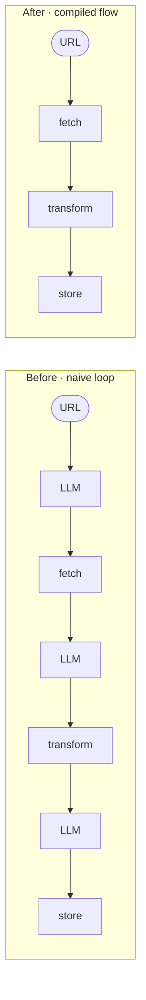

# Recipe 1 — Naive LLM loop to compiled flow

**You have:** an agent loop that calls an LLM between every tool step.
**You want:** the same three tool calls, with zero LLM calls between them.

This is the elevator pitch in code: the same fetch → transform → store work, expressed
two ways. Paired script: `examples/cookbook/recipe_01_naive_to_compiled.py`.

## The before

```python
def naive_loop(url: str) -> dict:
    plan = llm("What is the first step for URL?")
    payload = call_tool(plan, {"url": url})       # "fetch"

    plan2 = llm(f"Next step given rows in payload? payload={payload}")
    records = call_tool(plan2, {"payload": payload})  # "transform"

    plan3 = llm(f"Next step given records? records={records}")
    return call_tool(plan3, {"records": records})    # "store"
```

Three LLM round-trips for three tool calls. The model has to interpret the previous
step's output, decide which tool to call next, and shape the next input.

## The after

```python
from chainweaver import Flow, FlowExecutor, FlowRegistry, FlowStep

flow = Flow(
    name="fetch_transform_store",
    description="Fetch a URL, transform the payload, store the records.",
    steps=[
        FlowStep(tool_name="fetch", input_mapping={"url": "url"}),
        FlowStep(tool_name="transform", input_mapping={"payload": "payload"}),
        FlowStep(tool_name="store", input_mapping={"records": "records"}),
    ],
)

registry = FlowRegistry()
registry.register_flow(flow)
executor = FlowExecutor(registry=registry)
executor.register_tool(fetch_tool)
executor.register_tool(transform_tool)
executor.register_tool(store_tool)

result = executor.execute_flow("fetch_transform_store", {"url": "https://..."})
# result.final_output → {"url": "...", "payload": {...}, "records": [...], "stored_count": 3}
```

Three tool calls, zero LLM calls. The flow definition encodes what the LLM was
previously deciding at runtime.

## Diagram



## When this conversion is appropriate

- The order is fixed across runs.
- The mapping from one step's output to the next step's input is mechanical
  (`payload.rows → records`, not "summarise this in 2 sentences").
- You can describe the next tool from the previous output **without** needing the LLM to
  decide.

If any of those don't hold, the flow isn't ready to compile — go look at
[When ChainWeaver fits](../boundaries.md).

## What next

- [Recipe 5 — Schema drift in CI](05-schema-drift.md) — catch tool-schema changes before
  they reach production.
- [Concepts → Determinism](../concepts/determinism.md) — what "deterministic" buys you.
- [Data integrity guarantees](../data-integrity.md) — the five formal properties this
  conversion preserves.
