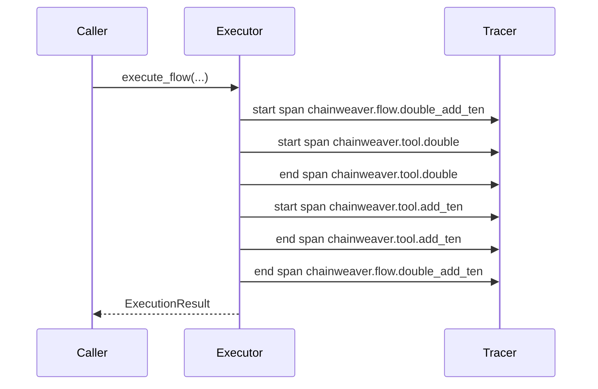

# Recipe 3 — OpenTelemetry tracing

**You have:** a compiled flow and an OpenTelemetry collector (Jaeger / Tempo / Datadog).
**You want:** one parent flow span plus one child span per step, automatically.

Paired script: `examples/cookbook/recipe_03_otel_tracing.py`.

## Setup

```bash
pip install "chainweaver[otel]"
# plus opentelemetry-sdk and your exporter of choice (e.g., opentelemetry-exporter-otlp)
```

## Wire the middleware

```python
from chainweaver import FlowExecutor, FlowRegistry
from chainweaver.integrations.opentelemetry import OTelTraceExporter
from opentelemetry import trace

tracer = trace.get_tracer("my.service")

executor = FlowExecutor(
    registry=registry,
    middleware=[OTelTraceExporter(tracer=tracer)],
)
```

That's it. Every subsequent `execute_flow` call emits:

- `chainweaver.flow.{flow_name}` — parent span covering the whole flow.
- `chainweaver.tool.{tool_name}` — one child span per executed step.

Span attributes include `chainweaver.trace_id`, `chainweaver.step_index`,
`chainweaver.tool.schema_hash`, and (on failure) `chainweaver.error.type`.

## Diagram



## After the fact

If you collected an `ExecutionResult` without OTel wired in (because the executor wasn't
configured for it), you can re-emit spans from the recorded trace:

```python
from chainweaver.integrations.opentelemetry import export_result_to_otel

export_result_to_otel(result, tracer=tracer)
```

The exporter never raises into the executor: hook failures are logged at WARNING and
swallowed so a misconfigured collector never aborts a flow.

## What next

- [Concepts → Execution trace](../concepts/execution-trace.md) — what each span attribute
  carries.
- `examples/otel_export.py` — the standalone OTel example.
