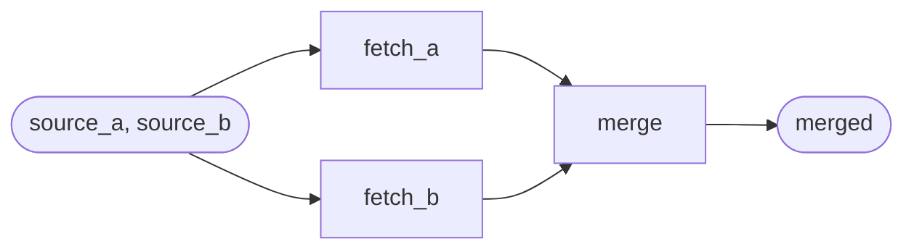

# Recipe 6 — Fan-out / fan-in DAG patterns

**You have:** two (or more) independent data sources you can fetch in parallel.
**You want:** a single flow that fans out, then merges the results — without orchestrating
the parallelism by hand.

Paired script: `examples/cookbook/recipe_06_dag_fanout.py`.

## The shape



```python
flow = DAGFlow(
    name="parallel_fetch_then_merge",
    description="Fan out to two sources, fan in to a single merge.",
    steps=[
        DAGFlowStep(
            step_id="src_a",
            tool_name="fetch_a",
            input_mapping={"source": "source_a"},
        ),
        DAGFlowStep(
            step_id="src_b",
            tool_name="fetch_b",
            input_mapping={"source": "source_b"},
        ),
        DAGFlowStep(
            step_id="merge",
            tool_name="merge",
            input_mapping={"rows_a": "rows_a", "rows_b": "rows_b"},
            depends_on=["src_a", "src_b"],
        ),
    ],
)
```

## How execution works

`DAGFlow` groups steps into topological **levels**. Steps with no dependencies form
level 0; steps that depend only on level-0 steps form level 1; and so on. Within a
level, the executor runs steps concurrently. The order *within* a level is deterministic
(stable topological sort), so traces from successive runs match.

For the example above:

- Level 0 — `src_a` and `src_b` run concurrently.
- Level 1 — `merge` runs after both upstreams have completed.

## Composing with linear flows

Wrap a `DAGFlow` as a `Tool` with `Tool.from_flow(...)` to use it as a step inside a
linear `Flow`:

```python
parallel_fetch_tool = Tool.from_flow(flow, executor)
executor.register_tool(parallel_fetch_tool)

outer = Flow(
    name="end_to_end",
    description="Parallel fetch + merge, then post-process.",
    steps=[
        FlowStep(
            tool_name="parallel_fetch_then_merge",
            input_mapping={"source_a": "source_a", "source_b": "source_b"},
        ),
        FlowStep(tool_name="post_process", input_mapping={"records": "merged"}),
    ],
)
```

## Constraints

- A `DAGFlow` with multiple sinks needs an explicit `output_schema` when wrapped via
  `Tool.from_flow(...)` — derivation can't pick a single canonical output schema.
- Cycles, duplicate `step_id`s, and unknown dependencies raise `DAGDefinitionError` at
  registration time. See [error table](../reference/error-table.md).

## What next

- [Concepts → Tools and flows](../concepts/tools-and-flows.md).
- `examples/etl_flow.py` — a five-step linear flow for contrast.
