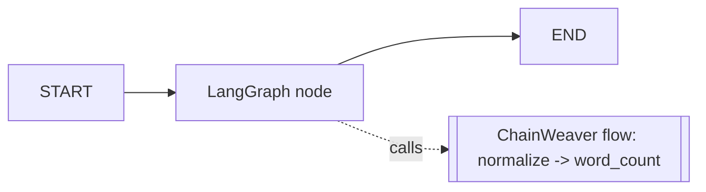

# Recipe — Call a ChainWeaver flow from a LangGraph node

**You have:** a LangGraph application.
**You want:** to run a known, deterministic multi-tool path inside one node —
without rewriting your graph.

Paired script: `examples/integrations/langgraph_node.py`.

ChainWeaver is **not** an alternative to LangGraph. LangGraph owns open-ended,
model-driven graph control; ChainWeaver owns the deterministic internal tool
paths. When a node needs to run such a path, it calls
`executor.execute_flow(...)` and merges the typed result back into graph state.

## Install

LangGraph is an optional extra:

```bash
pip install 'chainweaver[langgraph]'
```

## The boundary



## The node

```python
def run_flow_node(state: GraphState) -> dict[str, Any]:
    result = executor.execute_flow("enrich_text", {"text": state["raw_text"]})
    if not result.success or result.final_output is None:
        raise RuntimeError("enrich_text flow failed")
    return {
        "normalized": result.final_output["normalized"],
        "word_count": result.final_output["word_count"],
    }

graph = StateGraph(GraphState)
graph.add_node("run_flow", run_flow_node)
graph.add_edge(START, "run_flow")
graph.add_edge("run_flow", END)
app = graph.compile()
```

The node passes selected state fields *into* the flow and merges selected flow
outputs back *out*. LangGraph decides whether to enter the node; ChainWeaver runs
the path deterministically once inside.

## When this pattern fits

- **Good fit:** a sub-path of your graph is a fixed sequence of tool calls with
  no model decision in between.
- **Not a fit:** the next step depends on a model's judgement — keep that in
  LangGraph; only the deterministic stretch belongs in a flow.

## What next

- [OpenAI Agents SDK recipe](openai-agents-tool.md) — the same idea for a
  different runtime.
- The broader ecosystem bridge adapters are tracked in issue #82.
