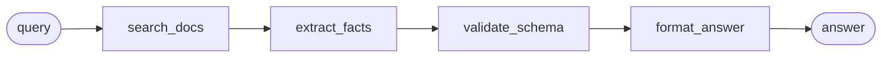

# Recipe — Before/after MCP-style flow

**You have:** an MCP-style agent that walks a repeated multi-tool path and asks a
model *between every step* which tool to call next.
**You want:** to see, concretely, what compiling that path into one ChainWeaver
flow buys you — fewer model-mediated decisions, a clearer trace, repeatable runs.

Paired script: `examples/mcp_style_before_after_demo.py`. It runs fully offline —
no external services, no network, no LLM.

## The path



## Before — naive, model-mediated routing

The "before" run simulates a naive agent that re-decides the next tool at each
hop. Every hop costs one (simulated) model decision, and each decision is a place
where a real model can hallucinate a field, drop data, or pick the wrong tool.

## After — one compiled flow

The "after" run registers the same path as a `Flow` and executes it once. There
are **zero** model decisions between steps; the executor maps each tool's output
onto the next tool's input with schema-checked I/O.

```python
flow = Flow(
    name="mcp_answer_flow",
    description="Search, extract, validate, and format an answer.",
    steps=[
        FlowStep(tool_name="search_docs", input_mapping={"query": "query"}),
        FlowStep(tool_name="extract_facts", input_mapping={"documents": "documents"}),
        FlowStep(tool_name="validate_schema", input_mapping={"facts": "facts"}),
        FlowStep(
            tool_name="format_answer",
            input_mapping={"facts": "facts", "valid": "valid"},
        ),
    ],
)
```

## What you get

Running the script prints a side-by-side comparison (steps run, model decisions,
simulated runtime) and writes two artifacts to a temp directory so you can see
what a compiled flow looks like on disk:

- `mcp_answer_flow.flow.json` — the saved flow definition (`flow_to_json`, so the demo stays runnable on a base install; YAML output would need the optional `chainweaver[yaml]` extra);
- `mcp_answer_flow.trace.json` — the `ExecutionResult` trace.

```
$ python examples/mcp_style_before_after_demo.py
...
Decisions avoided : 4
Final answer      : Verified facts: ChainWeaver overview; Data integrity.
```

## What next

- The low-level MCP adapter and flow server are tracked separately (issues #150,
  #72); this demo deliberately uses local stub tools so it stays offline.
- See the [correctness benchmark](https://github.com/dgenio/ChainWeaver/issues/103)
  for the data-integrity argument behind "fewer model-mediated decisions".
