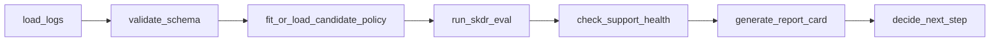

# Recipe — Offline policy-evaluation workflow (skdr-eval)

**You have:** logged decision data and a candidate policy you want to evaluate
offline before recommending it.
**You want:** a deterministic workflow that validates the data, runs the
evaluation, inspects support diagnostics, and gates the recommendation on
statistical evidence — not on an LLM prompt.

Paired script: `examples/skdr_policy_eval_flow.py`. It is fixture-based: no real
or private data, and no runtime dependency on `skdr-eval`.

## Why ChainWeaver fits

ML/evaluation pipelines are exactly the deterministic, predictable workflows
ChainWeaver targets. Each step should run without a model deciding what happens
next; the only "decision" is a deterministic gate on the evaluation result.

## The flow



## The deterministic gate

The final step is plain Python — no LLM:

```python
def decide_next_step_fn(inp: DecideInput) -> dict[str, Any]:
    if inp.support_health == "ok" and inp.stable:
        return {"recommendation": "continue experiment review", "gate": "continue"}
    if inp.support_health == "high_risk":
        return {"recommendation": "block deployment-style recommendation; improve data/support",
                "gate": "block"}
    return {"recommendation": "require manual / statistical review", "gate": "manual_review"}
```

| `support_health` | delta vs baseline | gate |
|---|---|---|
| `ok` | stable | continue experiment review |
| `caution` | any | manual / statistical review |
| `high_risk` | any | block; improve data/support |

## skdr-eval is an optional producer

`run_skdr_eval` here returns a synthetic, `EvaluationArtifact`-style fixture. In
a real workflow you replace it with a call into the `skdr-eval` package and read
its artifact. ChainWeaver does not depend on `skdr-eval` at runtime; if a
`weaver-spec` `EvaluationArtifact` contract is available, align the schema with
it.

## Output

```
$ python examples/skdr_policy_eval_flow.py
        ok  ->  [continue] continue experiment review
   caution  ->  [manual_review] require manual / statistical review
 high_risk  ->  [block] block deployment-style recommendation; improve data/support
```

## What next

- [Release-readiness workflow](release-readiness.md) for branching with
  `ConditionalEdge`.
