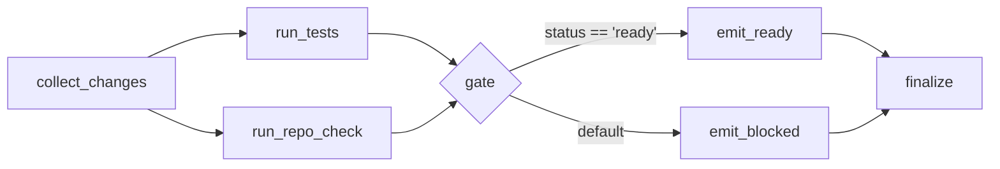

# Recipe — Deterministic release-readiness workflow

**You have:** a few checks you run before a PR or release (tests, a repository
check) and a yes/no readiness decision.
**You want:** to coordinate them as a deterministic flow that branches on the
results — with no LLM between steps.

Paired script: `examples/release_readiness_flow/release_readiness.py`. Runs
offline.

## The flow



This is a `DAGFlow`. After the `gate` decision step runs, the executor walks its
guarded edges and activates exactly one branch; the non-selected branch is
recorded as a skipped step.

```python
DAGFlowStep(
    tool_name="gate",
    step_id="gate",
    depends_on=["tests", "checks"],
    branches=[ConditionalEdge(target_step_id="ready", predicate="status == 'ready'")],
    default_next="blocked",
)
```

The predicate grammar is intentionally narrow and is evaluated without `eval()`
(see `chainweaver.contracts.evaluate_predicate`).

## Placeholders are the point

`run_tests` and `run_repo_check` are deterministic **placeholders**. In a real
setup you swap them for tools that shell out to:

- a test runner (`pytest`);
- linters / type checkers (`ruff`, `mypy`);
- a package check (`pip check`);
- a repository-policy tool such as VibeGuard.

The flow structure — collect, check, gate, branch, summarise — stays the same.

## Output

```
$ python examples/release_readiness_flow/release_readiness.py
clean change set  -> [READY] tests and repository checks passed
broken change set -> [BLOCKED] failed: tests
```

## What next

- [Fan-out / fan-in DAG patterns](06-dag-fanout.md) for more on `DAGFlow`.
- [Schema drift in CI](05-schema-drift.md) to guard the tools the gate depends on.
