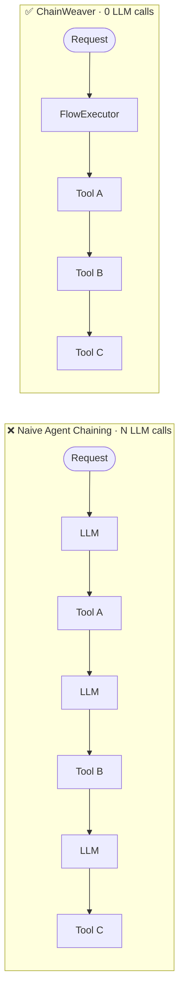

# ChainWeaver

**Deterministic orchestration layer for MCP-based agents.**

ChainWeaver compiles multi-tool flows into executable sequences that run **without any
LLM involvement between steps**. The executor is a graph runner, not a reasoning engine:
zero LLM calls, zero network I/O, zero randomness — by design.



## In 30 seconds

```python
from chainweaver import Tool, Flow, FlowStep, FlowRegistry, FlowExecutor

double = Tool(
    name="double",
    description="Doubles a number.",
    input_schema=NumberInput,
    output_schema=ValueOutput,
    fn=double_fn,
)

flow = Flow(
    name="calc",
    description="Double a number.",
    steps=[FlowStep(tool_name="double", input_mapping={"number": "number"})],
)

registry = FlowRegistry()
registry.register_flow(flow)
executor = FlowExecutor(registry=registry)
executor.register_tool(double)

result = executor.execute_flow("calc", {"number": 5})
# result.final_output → {"number": 5, "value": 10}
```

## Install

```bash
pip install chainweaver
```

Optional extras: `chainweaver[yaml]`, `chainweaver[otel]`, `chainweaver[docs]`.

## Where to next

<div class="grid cards" markdown>

-   **New here?**

    Start with [Your first flow](getting-started/first-flow.md), then walk the
    [Cookbook](cookbook/index.md).

-   **Evaluating?**

    [When ChainWeaver fits](boundaries.md) and
    [vs LangChain / Prefect / Dagster / Temporal / LangGraph](comparisons.md) cover
    the fit question.

-   **Need correctness guarantees?**

    [Data integrity guarantees](data-integrity.md) lists the five formal properties
    compiled flows preserve.

-   **Looking up an API?**

    The [CLI reference](cli.md) and
    [error table](reference/error-table.md) cover the operator surface.

</div>

## Core idea

ChainWeaver treats agent orchestration as a **compilation problem**, not a reasoning
problem:

| | Naive LLM chaining | ChainWeaver |
|---|---|---|
| LLM calls per step | 1 per step | **0** |
| Latency | O(n × LLM RTT) | O(n × tool RTT) |
| Reproducibility | Non-deterministic | **Deterministic** |
| Schema validation | Ad-hoc / none | **Pydantic enforced** |
| Observability | Prompt logs only | **Structured step records** |
| Reusability | Prompt templates | **Registered, versioned flows** |

ChainWeaver does not replace your agent. It sits **between** the agent's reasoning step
and the underlying tools: once you know the chain, compile it.
