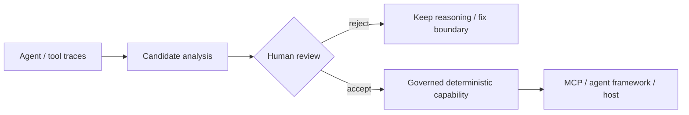

# ChainWeaver

**Find where your agent no longer needs to reason. Review the evidence. Turn the accepted path into a governed deterministic capability.**

ChainWeaver's deterministic executor is intentionally LLM-free between steps, but
**deterministic execution alone is not the product thesis**. If you already know a
workflow is fixed, a normal Python function or your existing agent/workflow framework
may be the simpler choice.

The hypothesis being tested is that ChainWeaver earns its place by starting from real
agent/tool behavior and adding value around **discovery, evidence, useful rejection,
review, security-boundary preservation, and drift detection** before a repeated path is
promoted to deterministic execution.

Read the public [Product validation & adoption gates](product-validation.md) for the
independent-trace experiment, manual-function baseline, security invariant, and
kill/pivot criteria.

> **Security boundary:** ChainWeaver may remove unnecessary reasoning boundaries. It
> must never silently remove authorization or approval boundaries.


```mermaid
flowchart LR
    traces[Agent / tool traces] --> analysis[Candidate analysis]
    analysis --> review{Human review}
    review -->|reject| rejected[Keep reasoning / fix boundary]
    review -->|accept| capability[Governed deterministic capability]
    capability --> host[MCP / agent framework / host]
```

## In 30 seconds: the execution substrate

Once a path has actually earned deterministic promotion, the runtime is deliberately
simple:

```python
from chainweaver import Tool, Flow, FlowStep, FlowRegistry, FlowExecutor

double = Tool(
    name="double",
    description="Doubles a number.",
    input_schema=NumberInput,
    output_schema=ValueOutput,
    fn=double_fn,
)

flow = Flow(
    name="calc",
    description="Double a number.",
    steps=[FlowStep(tool_name="double", input_mapping={"number": "number"})],
)

registry = FlowRegistry()
registry.register_flow(flow)
executor = FlowExecutor(registry=registry)
executor.register_tool(double)

result = executor.execute_flow("calc", {"number": 5})
# result.final_output → {"number": 5, "value": 10}
```

No model call is made between deterministic steps. Inputs and outputs are validated,
execution is traceable, and drift/safety contracts can be checked around governed
promotion and deployment.

## Why not just write a function?

Often, you should.

ChainWeaver should be adopted only when its lifecycle adds enough value beyond the
manual baseline. The current validation program explicitly compares accepted candidates
against plain Python or the host framework and asks whether independent users would keep
ChainWeaver installed.

Potential advantages being tested include:

- discovering useful repeated model-mediated paths that were not already obvious;
- proving recurrence and cumulative dataflow from real evidence;
- rejecting paths that still require semantic judgment or unsafe privilege aggregation;
- producing reproducible review evidence and stable artifact identity;
- suspending governed execution when schema, safety, or policy contracts drift;
- optionally exporting the accepted capability to the host that already owns the agent.

If those advantages do not survive independent validation, the project should pivot
before v1 rather than redefining success.

## Install

```bash
pip install chainweaver
```

Optional extras include `chainweaver[yaml]`, `chainweaver[otel]`,
`chainweaver[mcp]`, and framework-specific integrations.

## Where to next

<div class="grid cards" markdown>

-   **Evaluating the product?**

    Start with [Product validation & adoption gates](product-validation.md) and
    [When ChainWeaver fits](boundaries.md). They include the explicit reasons to use a
    normal function or another framework instead.

-   **Trying the deterministic core?**

    Use [Your first flow](getting-started/first-flow.md), then the
    [Cookbook](cookbook/index.md).

-   **Comparing alternatives?**

    [vs LangChain / Prefect / Dagster / Temporal / LangGraph](comparisons.md) covers the
    fit question. ChainWeaver does not claim those systems cannot execute deterministic
    code.

-   **Need correctness/security boundaries?**

    [Data integrity guarantees](data-integrity.md),
    [Runtime responsibilities](runtime-responsibilities.md), and
    [Security policy](security.md) document the current guarantees and host boundary.

-   **Looking up an API?**

    The [CLI reference](cli.md) and
    [error table](reference/error-table.md) cover the operator surface.

</div>

## Current strategic gates

The roadmap is validation-first:

1. independent product falsification on real agent workloads (#553);
2. preserve authorization and approval boundaries during macro-capability compilation
   (#554);
3. reduce the v1 compatibility promise through explicit API tiers (#522);
4. make release/package/docs state coherent (#519);
5. make minimized/shape-only trace handling the safe default (#527);
6. build the large canonical evidence architecture (#334) and production golden path
   (#498) only after validation justifies them.

The measurable v1 bar is in [v1-release-criteria.md](v1-release-criteria.md). Stars are
not a release criterion; independent use, repeated adoption, security review, and
compatibility stability are.
